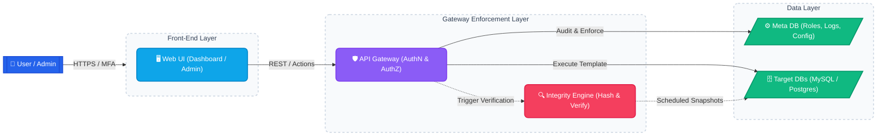
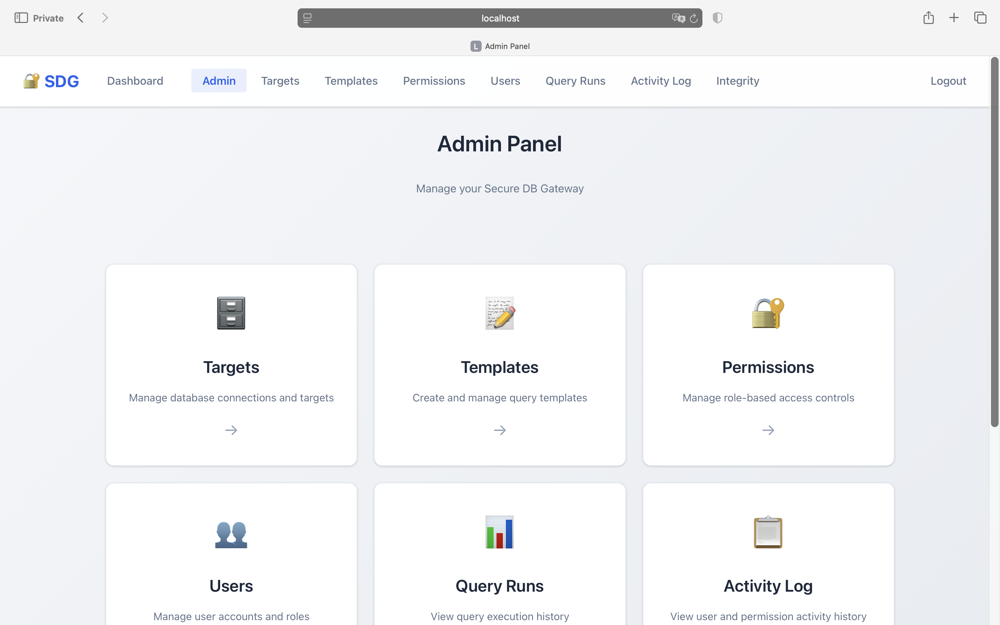
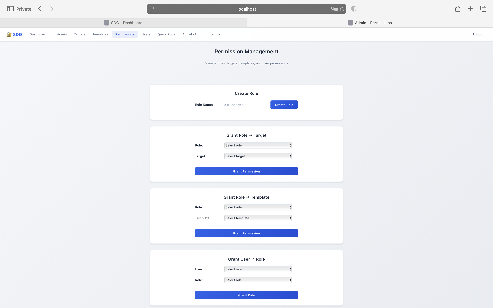
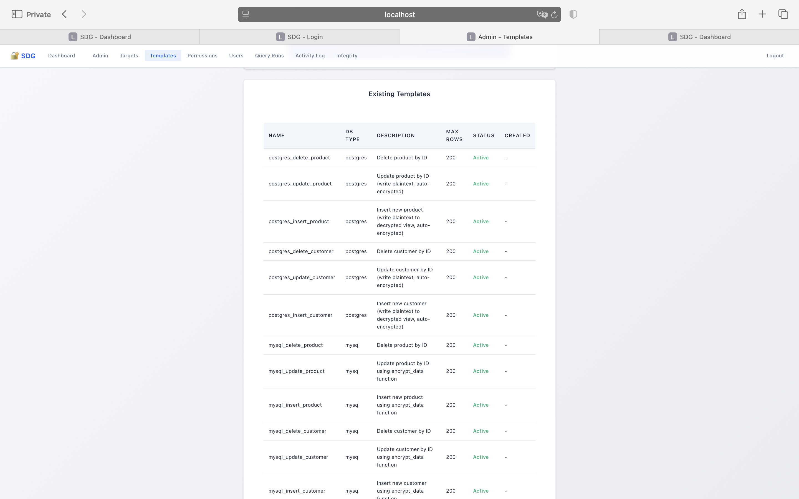
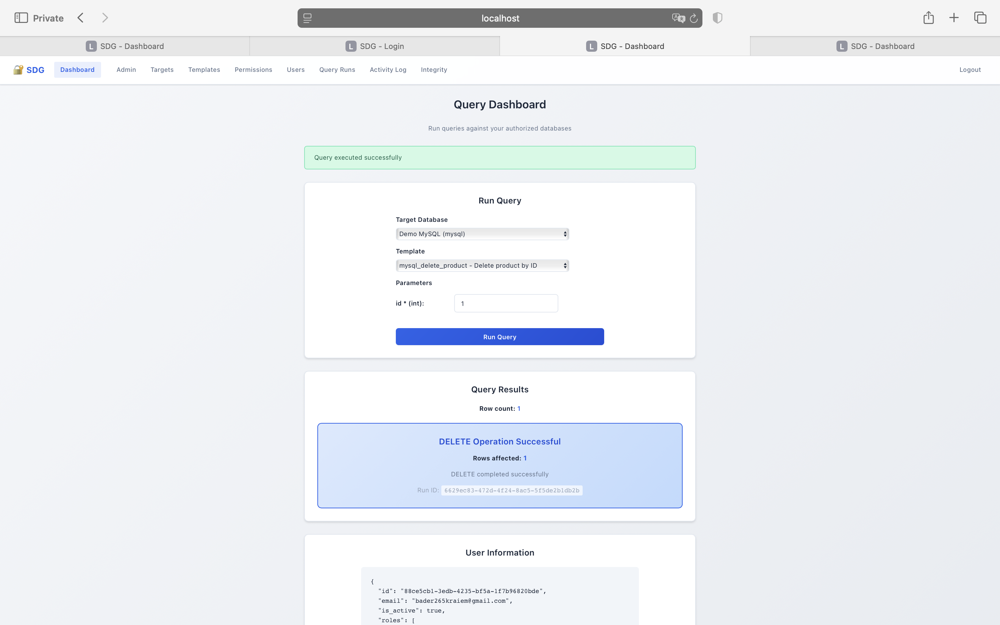
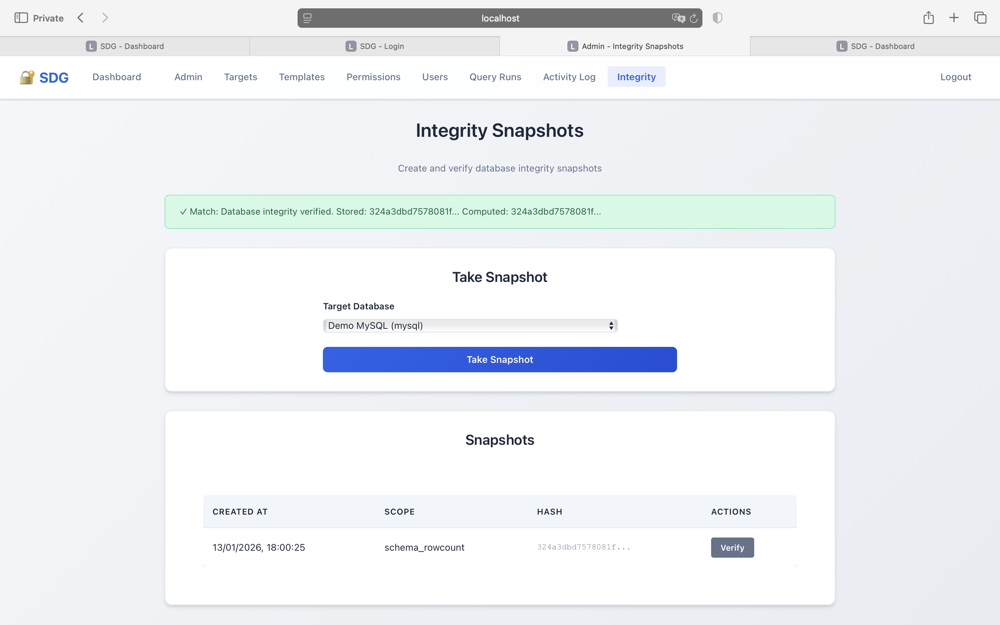
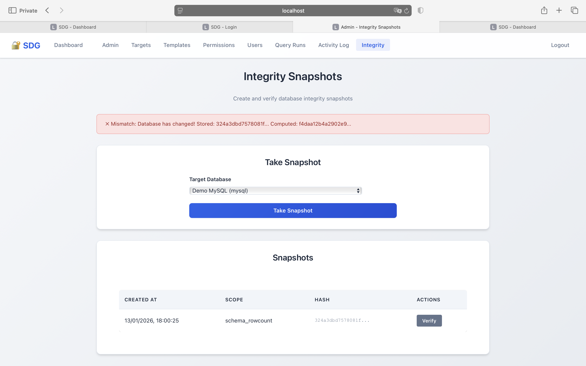
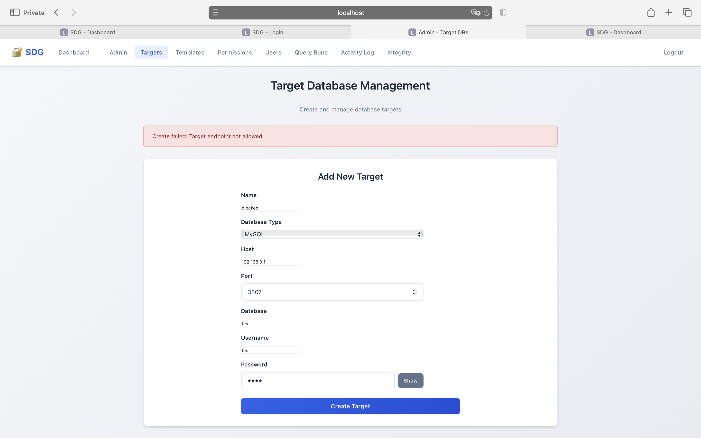
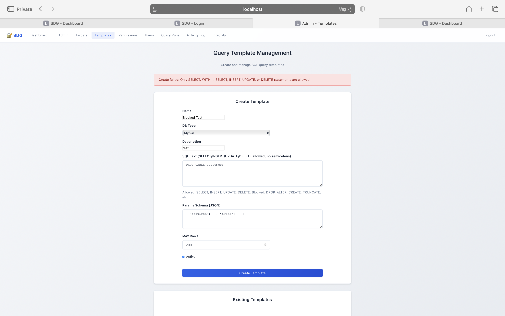

# Secure Database Gateway (SDG)

**SDG** is a security-first access layer between users and databases. It enforces **MFA (OTP)**, **RBAC**, **template-only SQL execution**, **SQL safety controls**, **SSRF-safe target validation**, and **auditability** (logs + integrity snapshots).

This repository is a **US-grade showcase**, featuring complete documentation, architectural reports, and curated UI evidence to demonstrate security posture and best practices.

---

## Why this matters
Direct database access creates credential sprawl and weak auditability. SDG centralizes control into one rigid enforcement point:
- Authenticate strongly (**MFA**)
- Authorize explicitly (**RBAC grants**)
- Execute safely (**approved templates only**)
- Block abuse (**SQL safety + SSRF/allowlist**)
- Provide evidence (**logs + integrity verification**)

---

## Key security controls (evidence-based)

| Control | What it stops | Evidence |
|---|---|---|
| RBAC grants | Unauthorized access | `docs/assets/permissions.png` |
| Template-only SQL | Raw SQL / injection paths | `docs/assets/templates.png` |
| SQL safety enforcement | Destructive SQL (`DROP`, etc.) | `docs/assets/sql_blocked_drop.png` |
| Target allowlist validation | SSRF / internal pivoting | `docs/assets/target_endpoint_blocked.png` |
| Integrity snapshots | Silent DB changes | `docs/assets/integrity_match.png` / `docs/assets/integrity_mismatch.png` |

More details in `docs/CONTROL_MATRIX.md`.

---

## Architecture (high level)

## UI Evidence (Screenshots)

**Admin Panel**  

<b>Show full evidence set</b>

 

**RBAC Permission Management**  

**Approved Templates (no raw SQL)**  

**Controlled execution (success)**  

**Integrity verification (match / mismatch)**  
  

**Enforcement proofs**  
  

*Screenshot mapping index:* `docs/SCREENSHOTS.md`

---

## Documentation
- **Full report (PDF)**: `docs/SDG_Project_Report.pdf`
- **Demo walkthrough**: `docs/DEMO_WALKTHROUGH.md`
- **Threat model**: `docs/THREAT_MODEL.md`

---

## Ownership

- **Owner / Maintainer**: Badr Karim
- **GitHub**: [@badrnkarim](https://github.com/badrnkarim)

## License
MIT License — see [LICENSE](LICENSE) for details.
