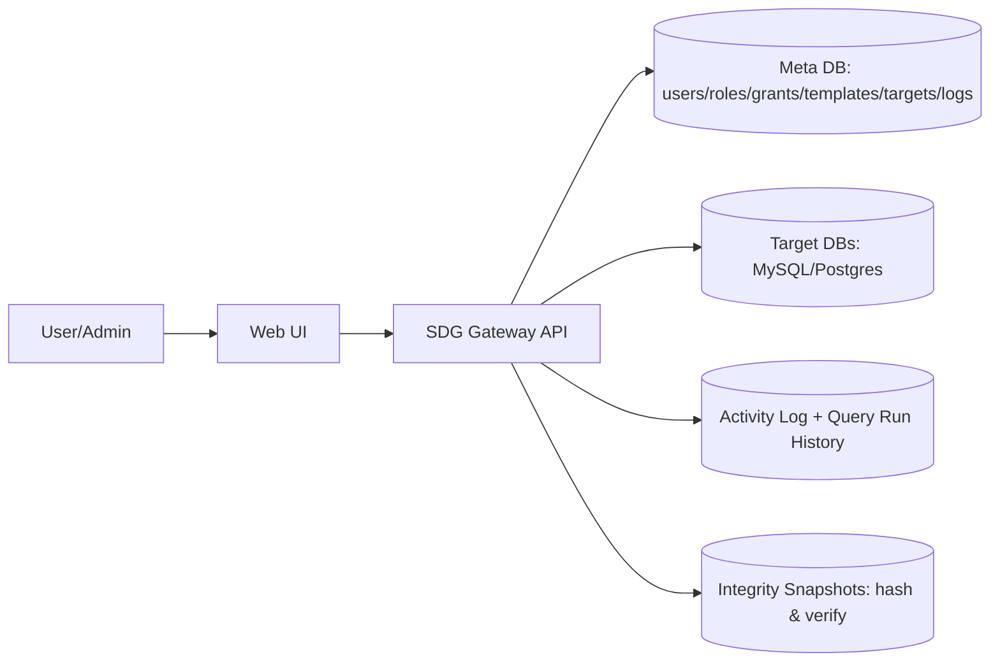

# Secure Database Gateway (SDG)

**SDG** is a security-first gateway between users and databases. It enforces **MFA (OTP)**, **RBAC**, **template-only SQL execution**, **SQL safety controls**, **SSRF-safe target validation**, and **full auditability** (activity logs, query-run history, integrity snapshots).

> This repository is a **showcase** (documentation + UI evidence). It’s designed to be recruiter-friendly and audit-friendly.

---

## What SDG prevents (at a glance)
- Direct DB access sprawl and unmanaged credentials
- Raw SQL submission from users
- Dangerous statements (e.g., `DROP`) via safety enforcement
- Target endpoint abuse / internal pivoting (allowlist validation)
- Untracked admin actions (full audit trail)

---

## Architecture

More details: **docs/ARCHITECTURE.md**

---

## Key Security Controls

| Control | What it enforces | Evidence |
|---|---|---|
| MFA (OTP) | Stronger authentication for access | Project report + UI flows |
| RBAC | Explicit grants: Role→Target, Role→Template, User→Role | `docs/assets/permissions.png` |
| Template-only SQL | Users can’t submit raw SQL | `docs/assets/templates.png` |
| SQL safety | Blocks dangerous operations (e.g., DROP) | `docs/assets/sql_blocked_drop.png` |
| SSRF-safe targets | Allowlist endpoint validation | `docs/assets/target_endpoint_blocked.png` |
| Auditability | Activity Log + Query Run History | UI + report |
| Integrity snapshots | Detects changes over time | `docs/assets/integrity_match.png`, `integrity_mismatch.png` |

More details: **docs/SECURITY_CONTROLS.md**

---

## Screenshots (UI Evidence)

### Admin Panel

  

<b>Show more screenshots</b>

**RBAC Permission Management**

  

**Templates (approved query templates)**

  

**Controlled execution (template run success)**

  

**Integrity verification (match / mismatch)**

  

  

**Security enforcement proofs**

  

  

Screenshot mapping: **docs/SCREENSHOTS.md**

---

## Documentation
- Full report (PDF): **docs/SDG_Project_Report.pdf**
- One-pager: **docs/ONE_PAGER.md**

---

## Ownership
**Owner / Maintainer:** Badr Karim  
Repo: https://github.com/badrnkarim/sdg-secure-db-gateway-showcase

See **AUTHORS.md** for contributors.

---

## License
MIT — see **LICENSE**.
